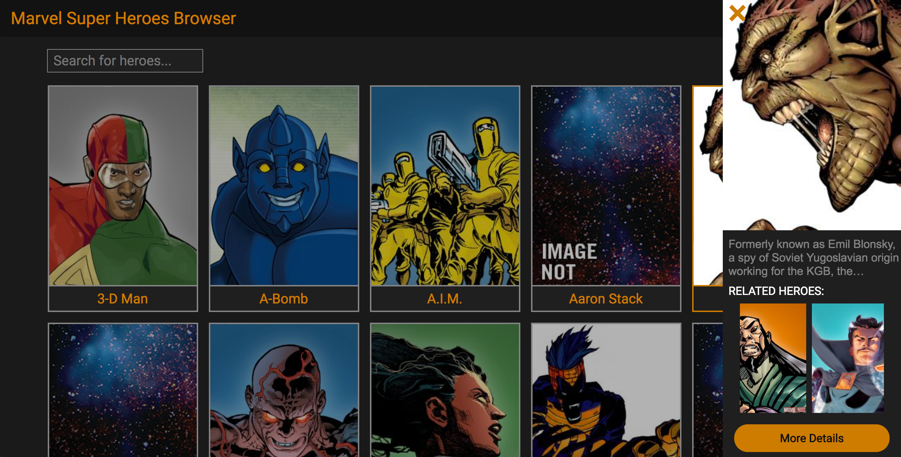
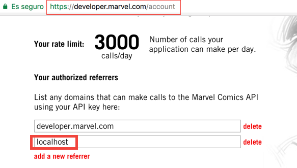

# Marvel Super Heroes Browser

**Marvel Super Heroes** is an app that allow you to browse for your favourite heroes and know a little more about them.

The only purpose of this app is to allow me to experiment with Angular. It's a initial version and I expect to be adding new features soon.

## Tech Stack
* Angular
* Ngrx/store
* Rxjs

## Getting started
1. Clone this repo and `cd` into the project folder.
2. Run `npm i`.
3. Run `npm start`.
4. Open http://localhost:4200/ with your browser.
5. Have fun!

**NOTE:** I already provided you with an api key (src/app/config/index.ts) for the Marvel Api but keep in mind that this key is shared with everyone and there is a daily limit. To avoid headaches I recommend you to grab your own key from here: https://developer.marvel.com/.

Make sure to whitelist localhost or whatever domain you use for the app as shown in the photo.

